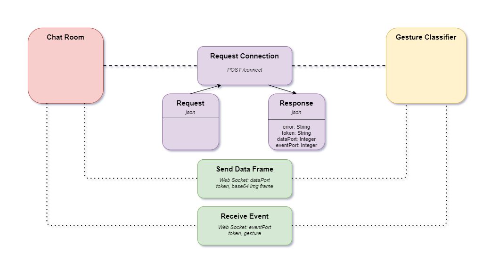

Chat Room - Gesture Classifier
==============================

Chat room instances are requesting connections for the Gesture Classifier
in order to proceed with the gestures studying for a specific chat room.
A successful connection is followed by a frame exchange (in a **base64** format)
and constant gesture study resulting in real time classifications (resulted **json** data).

